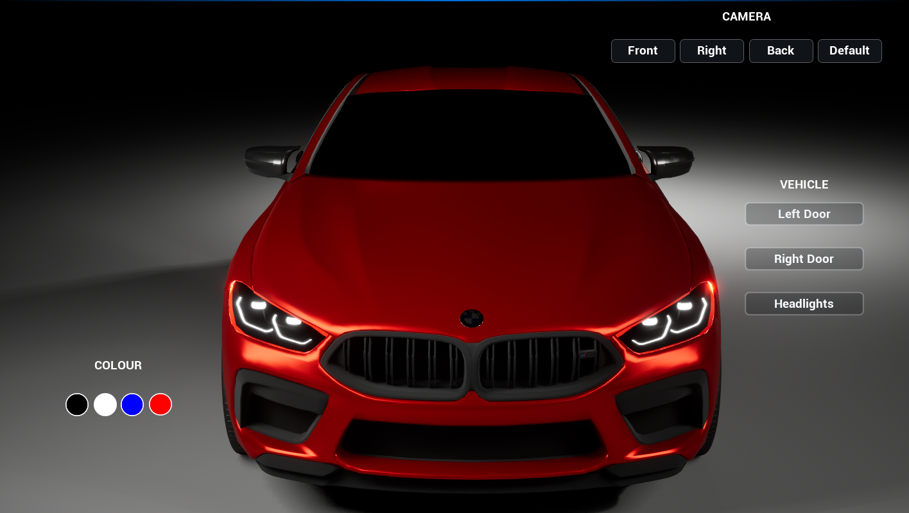

# Vehicle Configurator

Interactive real-time 3D vehicle configurator developed in Unreal Engine 5.

The project demonstrates vehicle customization, Blueprint-based interaction, UI development, camera controls, lighting, and 3D asset integration.

## Features

- Real-time vehicle paint customization
- Animated left and right doors
- Headlight controls with emissive lighting
- Multiple vehicle inspection camera views
- UMG-based user interface
- Showroom environment and vehicle-focused lighting
- Blender-based vehicle asset preparation
- Mesh separation and pivot correction for interactive components

## Technologies

- Unreal Engine 5
- Blueprints
- UMG
- Blender
- Unreal Material System
- Git / Git LFS

## Project Overview

The project was created as an interactive automotive visualization application.

Vehicle components and assets were prepared in Blender and Unreal Engine, including mesh cleanup, separation, pivot adjustment, and material configuration.

Blueprints are used to control user interactions such as vehicle color changes, door animations, headlights, and camera switching.

The user interface was created using Unreal Motion Graphics (UMG).

## Controls / Interaction

The UI allows the user to:

- Change the vehicle paint
- Open and close the left door
- Open and close the right door
- Turn headlights on and off
- Switch between different vehicle camera views

## Screenshots

The screenshots below demonstrate the current Vehicle Configurator, including the showroom environment, interactive controls, vehicle customization, animated components, headlights, and multiple inspection views.

<table>
  <tr>
    <td align="center">
      <br>
      <b>Front View</b>
    </td>
    <td align="center">
      <br>
      <b>Front View Interaction UI</b>
    </td>
  </tr>
  <tr>
    <td align="center">
      <br>
      <b>Door Interaction</b>
    </td>
    <td align="center">
      <br>
      <b>Headlight</b>
    </td>
  </tr>
  <tr>
    <td align="center">
      <br>
      <b>Right View</b>
    </td>
    <td align="center">
      <br>
      <b>Back View</b>
    </td>
  </tr>
</table>

<!-- Example:

-->

## Demo

A downloadable Windows demo will be available on itch.io.

**itch.io:** Coming soon

## Project Structure

```text
VehicleConfigurator/
├── Config/
├── Content/
├── VehicleConfigurator.uproject
├── .gitignore
├── .gitattributes
└── README.md
